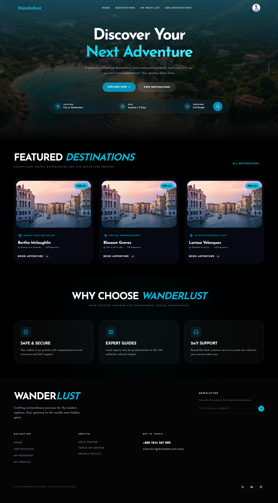

# 🌍 Wanderlust: A Premium Full-Stack Travel & Tourism Platform

Wanderlust is a modern, high-performance, and feature-rich Travel Booking Platform designed for passionate explorers. Built using the MERN stack ecosystem, this application provides a seamless, intuitive experience for users to discover breathtaking destinations, plan trips, and manage bookings, while providing clean management interfaces for administrators.

## 🚀 Live Demonstration

👉 [Wanderlust Live Application](https://wanderlust-client-rust.vercel.app)

---

## 📸 Platform Preview

### 🏠 Hero Section & Advanced Exploration Search



---

## 🎯 Strategic Purpose & Scope

The core goal of Wanderlust is to bridge the gap between travelers and their dream adventures by streamlining the exploration and booking process. The application focuses heavily on high visual impact, performance optimization, secure user flows, and structured state management to mirror modern enterprise-level travel platforms.

---

## ✨ Key Technical Architecture & Features

### 1. 🔍 Contextual Advanced Search & Filters

- Dynamic inputs for tracking location, destination constraints, date ranges, and traveler counts directly from the landing page.
- Instant feedback loops for querying curated adventure spaces.

### 2. 🗂 Structured Destination Showcases

- **Featured Destinations:** Highly interactive cards displaying localized pricing metrics, rating metrics, tour duration, and interactive "Book Adventure" action triggers.
- Fully dynamic single-destination profile breakdowns.

### 3. 🛡 Robust Authentication & Security Layer

- Hybrid JSON Web Token (JWT) workflow incorporating secure `HTTPOnly` cookie transport mechanics to mitigate XSS risks.
- Seamless third-party OAuth integrations (Google Authentication support).

### 4. 🎛 Seamless CRUD & Request Pipelines

- Multi-tier dynamic state configurations enabling authenticated clients to customize destination logs, map bookmarked inventories ("My Book List"), and dispatch immediate requests to internal databases.
- Real-time updates across tracking components.

### 5. 📱 Pixel-Perfect Responsive Layouts

- Designed with strict mobile-first engineering guidelines ensuring seamless scalability across mobile viewports, high-density tablets, and wide-screen desktop displays.

---

## 🛠 Advanced Enterprise Tech Stack

### Frontend Architecture

- **React.js (Vite)** – High-speed development and build pipelines via modern ES modules.
- **Tailwind CSS & DaisyUI** – Utility-first CSS modeling coupled with highly reusable, desaturated responsive UI components.
- **React Router Dom** – Structured client-side routing with protected route middleware.
- **Axios & TanStack Query (React Query)** – Declarative data-fetching mechanics, custom caching policies, and optimized automatic background re-fetching.
- **Framer Motion** – Production-ready micro-interactions and smooth scroll transitions.

### Backend & Database Layer

- **Node.js & Express.js** – Asynchronous event-driven RESTful API routing architecture.
- **MongoDB & Mongoose ODM** – Strongly typed schema structures handling structural relational properties inside a NoSQL engine.
- **Dotenv & CORS** – Secure environment context isolation and Cross-Origin Resource Sharing policy optimization.

---

## ⚙️ Engineering Setup Guide (Local Replication)

To replicate this environment locally, please follow the structured implementation manual outlined below:

### Phase 1: Repository Extraction & Entry

```bash
https://github.com/themdshakibul/Wanderlust-Client.git
cd wanderlust
```
